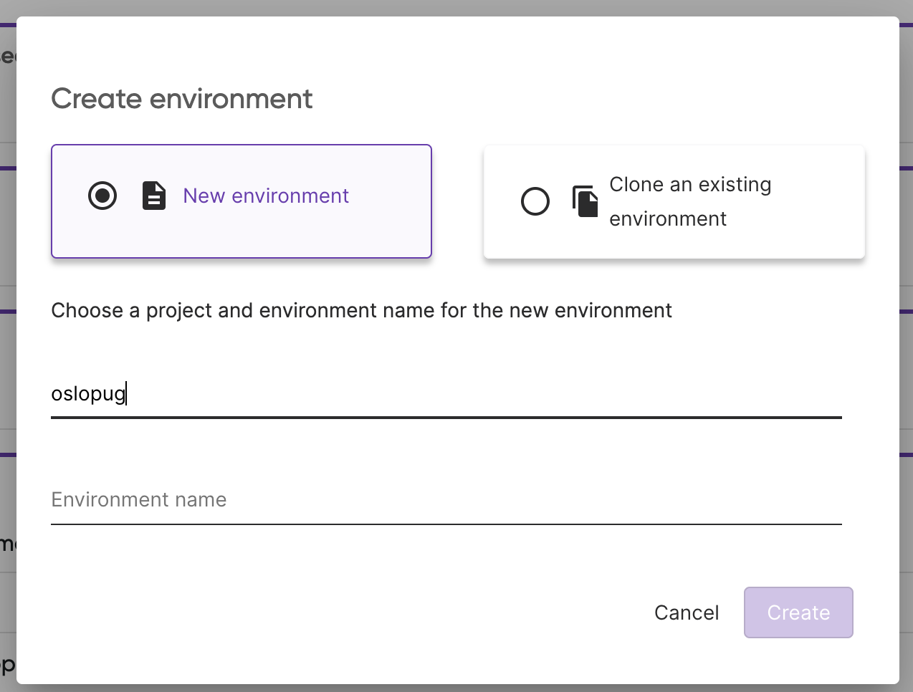
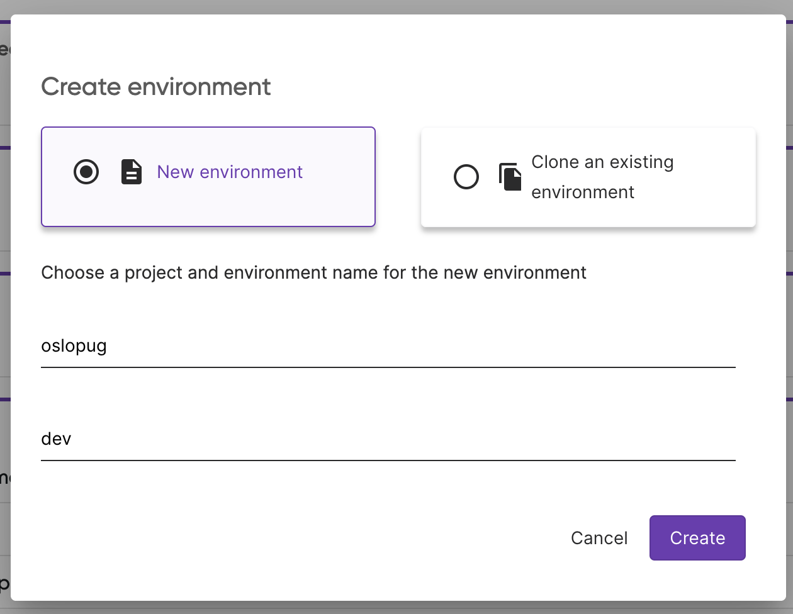

# Chapter 1 - Deploy the Application to Kubernetes

## Overview

In this chapter, we'll explore some advanced Pulumi techniques:

- **Stack References**: Learn how to share outputs between various stacks
  using [Stack References](https://www.pulumi.com/docs/intro/concepts/stack/#stackreferences).

- **Programmatic Kubernetes Provider Creation**: Familiarize yourself with the `Provider` resource to create a
  Kubernetes provider programmatically. This is especially handy if you aim to utilize a different Kubernetes provider
  than the one initially used to establish the cluster.

- **Kubernetes Resource Deployment**: Discover how to deploy diverse Kubernetes resources to your cluster, sidestepping
  the traditional use of YAML files.

- **Pulumi ESC**: Learn how to use the Pulumi ESC to retrieve configuration and secrets from the Pulumi ESC inside your
  Pulumi program.

## Prerequisites

- The Kubernetes cluster from the [previous chapter](/00-create-kubernetes-cluster.md)

## Instructions

### Step 1 - Kickstart with a New Pulumi CLI Template!

> If you run Pulumi for the first time, you will be asked to log in. Follow the instructions on the screen to
> login. You may need to create an account first, don't worry it is free.

To lay the groundwork for a new Pulumi project, execute the command `pulumi new`.

Pulumi has plenty of pre-configured templates. For a comprehensive list, visit
the [Pulumi Templates](https://www.pulumi.com/templates/) page. And here's the exciting part: you're not confined to
these templates. Feel free to craft your bespoke templates and share the innovation with your team or broader
organization.

```bash
pulumi new kubernetes-<language>
```

You will be guided through a wizard to create a new Pulumi project. You can use the following values:

```bash
project name (01-create-nginx-deployment):
project description (A minimal <language> Pulumi program):  
Created project '01-create-nginx-deployment'

Please enter your desired stack name.
To create a stack in an organization, use the format <org-name>/<stack-name> (e.g. `acmecorp/dev`).
stack name (dev): dev 
...
```

The chosen template will default to Pulumi's standard Kubernetes provider, which aligns with your current Kubernetes
context. However, recalling our previous chapter, we crafted a Kubernetes cluster. Naturally, we'd want to utilize
the `kubeconfig` file from that endeavor. To achieve this, we can programmatically establish a Kubernetes provider with
the aid of the `Provider` resource.

Our first task is to fetch the `kubeconfig` output from the `00-create-kubernetes-cluster` stack. This can be seamlessly
accomplished through `StackReference`s.

For a deeper understanding and implementation details tailored to your programming language, refer to
the [StackReference documentation](https://www.pulumi.com/docs/concepts/stack/#stackreferences).

```yaml
resources:
  kubeconfig:
    type: pulumi:pulumi:StackReference
    properties:
      name: dirien/00-solution-civo-csharp/dev
```

<details>
  <summary>CSharp</summary>
    
    using System.Collections.Generic;
    using Pulumi;
    
    var kubeconfig = new StackReference("kubeconfig", new StackReferenceArgs
    {
        Name = "dirien/00-solution-civo-csharp/dev",
    });
    
</details>
<details>
  <summary>Go</summary>
    
    package main
    
    import (
        "github.com/pulumi/pulumi/sdk/v3/go/pulumi"
    )
    
    func main() {
        pulumi.Run(func(ctx *pulumi.Context) error {
            kubeconfig, err := pulumi.NewStackReference(ctx, "kubeconfig", &pulumi.StackReferenceArgs{
                Name: pulumi.String("<organization>/<project>/<stack>"),
            })
            if err != nil {
                return err
            }
            return nil
        })
    }
    
</details>
<details>
  <summary>Java</summary>
    
    import com.pulumi.Context;
    import com.pulumi.Pulumi;
    import com.pulumi.StackReference;
    import com.pulumi.StackReferenceArgs;
    
    var kubeconfig = new StackReference("kubeconfig", StackReferenceArgs.builder()
      .name("<organization>/<project>/<stack>")
      .build());
    
    
</details>
<details>
  <summary>Python</summary>
    
    import pulumi
    
    kubeconfig = pulumi.StackReference("kubeconfig", stack_name="<organization>/<project>/<stack>")
    
</details>
<details>
  <summary>Typescript</summary>
    
    const pulumi = require("@pulumi/pulumi");
    
    const kubeconfig = new pulumi.StackReference("kubeconfig", {
        name: "<organization>/<project>/<stack>",
    });
    
</details>

### Step 2 - Get the Stack outputs

To retrieve the outputs of the different stacks, we use `StackReference`s. 

> Stack references always in the format `<organization>/<project>/<stack>`.

Pulumi will ask you now to create a new stack. You can name the stack whatever you want. If you run Pulumi with the
local login, please make sure to use for every stack a different name.

### Step 2 - Pulumi ESC

Head to Pulumi Cloud Console and create a new Pulumi ESC project with the name `oslopug`:



And the environment `dev`:



In the editor add the following yaml into the `Environment definition`:

```yaml
values:
  nginx:
    title: Pulumi ESC
    body: Hello from Pulumi ESC! You can change me.
  pulumiConfig:
    nginxTitle: ${nginx.title}
    nginxBody: ${nginx.body}
```

If you prefer to use the Pulumi CLI, you can create the environment by running:

```bash
pulumi env init <your-org>/oslopug/dev
``` 

And set the configuration by running the `env edit` command and copy the above YAML into the editor:

```bash
pulumi env edit <your-org>/oslopug/dev
```

Now, we need to link the Pulumi ESC project to the Pulumi IaC project. To do this, we need to add the following to your `Pulumi.<stackname>.yaml`:

```yaml
environment:
- oslopug/dev
```

### Step 3 - Deploy the application

Before we can deploy the application you need to know that since we create the Kubernetes provider programmatically, we
need to pass the `Provider` resource to every Kubernetes resource we want to create.

Check the documentation for the [Explicit Provider Configuration
](https://www.pulumi.com/docs/concepts/resources/providers/#explicit-provider-configuration) for your programming
language.

In my case it looks like this:

```yaml
name: 01-solution
description: A minimal Pulumi YAML program
runtime: yaml

variables:
  title: ${nginxTitle}
  body: ${nginxBody}

resources:
  kubeconfig:
    type: pulumi:pulumi:StackReference
    properties:
      name: dirien/00-solution-civo-csharp/dev

  do_k8s_provider:
    type: pulumi:providers:kubernetes
    properties:
      enableServerSideApply: true
      kubeconfig: ${kubeconfig.outputs["kubeconfig"]}

  nginxConfigMap:
    type: kubernetes:core/v1:ConfigMap
    properties:
      metadata:
        name: nginx-config
      data:
        index.html: |
          <!DOCTYPE html>
          <html>
          <head>
              <title>${title}</title>
          </head>
          <body>
              <h1>${body}</h1>
          </body>
          </html>
    options:
      provider: ${do_k8s_provider}

  nginxDeployment:
    type: kubernetes:apps/v1:Deployment
    properties:
      metadata:
        name: nginx-deployment
        annotations:
          reloader.stakater.com/auto: "true"
      spec:
        replicas: 1
        selector:
          matchLabels:
            app: nginx
        template:
          metadata:
            labels:
              app: nginx
          spec:
            containers:
            - name: nginx
              image: nginx:latest
              ports:
              - containerPort: 80
              volumeMounts:
              - name: nginx-html
                mountPath: /usr/share/nginx/html/index.html
                subPath: index.html
            volumes:
            - name: nginx-html
              configMap:
                name: nginx-config
                items:
                - key: index.html
                  path: index.html
    options:
      provider: ${do_k8s_provider}

  nginxService:
    type: kubernetes:core/v1:Service
    properties:
      metadata:
        name: nginx-service
      spec:
        selector:
          app: nginx
        type: LoadBalancer
        ports:
        - port: 8080
          targetPort: 80
    options:
      provider: ${do_k8s_provider}

outputs:
  serviceName: ${nginxService.metadata.name}
```

<details>
  <summary>CSharp</summary>
    

    using System.Collections.Generic;
    using Pulumi;
    using Kubernetes = Pulumi.Kubernetes;
    
    return await Deployment.RunAsync(() =>
    {
    var config = new Config();
    var title = config.Get("nginxTitle");
    var body = config.Get("nginxBody");
    
        var kubeconfig = new StackReference("kubeconfig", new()
        {
            Name = "<organization>/<project>/<stack>",
        });
    
        var doK8SProvider = new Kubernetes.Provider("do_k8s_provider", new()
        {
            EnableServerSideApply = true,
            KubeConfig = kubeconfig.RequireOutput("kubeconfig").Apply(kubeconfig => 
            {
                return kubeconfig.ToString() ?? "";   
            }),
        });
    
        var nginxConfigMap = new Kubernetes.Core.V1.ConfigMap("nginxConfigMap", new()
        {
            Metadata = new Kubernetes.Types.Inputs.Meta.V1.ObjectMetaArgs
            {
                Name = "nginx-config",
            },
            Data = 
            {
                { "index.html", @$"<!DOCTYPE html>
    <html>
    <head>
        <title>{title}</title>
    </head>
    <body>
        <h1>{body}</h1>
    </body>
    </html>
    " },
            },
        }, new CustomResourceOptions
        {
            Provider = doK8SProvider,
        });
    
        var nginxDeployment = new Kubernetes.Apps.V1.Deployment("nginxDeployment", new()
        {
            Metadata = new Kubernetes.Types.Inputs.Meta.V1.ObjectMetaArgs
            {
                Name = "nginx-deployment",
                Annotations = 
                {
                    { "reloader.stakater.com/auto", "true" },
                },
            },
            Spec = new Kubernetes.Types.Inputs.Apps.V1.DeploymentSpecArgs
            {
                Replicas = 1,
                Selector = new Kubernetes.Types.Inputs.Meta.V1.LabelSelectorArgs
                {
                    MatchLabels = 
                    {
                        { "app", "nginx" },
                    },
                },
                Template = new Kubernetes.Types.Inputs.Core.V1.PodTemplateSpecArgs
                {
                    Metadata = new Kubernetes.Types.Inputs.Meta.V1.ObjectMetaArgs
                    {
                        Labels = 
                        {
                            { "app", "nginx" },
                        },
                    },
                    Spec = new Kubernetes.Types.Inputs.Core.V1.PodSpecArgs
                    {
                        Containers = new[]
                        {
                            new Kubernetes.Types.Inputs.Core.V1.ContainerArgs
                            {
                                Name = "nginx",
                                Image = "nginx:latest",
                                Ports = new[]
                                {
                                    new Kubernetes.Types.Inputs.Core.V1.ContainerPortArgs
                                    {
                                        ContainerPortValue = 80,
                                    },
                                },
                                VolumeMounts = new[]
                                {
                                    new Kubernetes.Types.Inputs.Core.V1.VolumeMountArgs
                                    {
                                        Name = "nginx-html",
                                        MountPath = "/usr/share/nginx/html/index.html",
                                        SubPath = "index.html",
                                    },
                                },
                            },
                        },
                        Volumes = new[]
                        {
                            new Kubernetes.Types.Inputs.Core.V1.VolumeArgs
                            {
                                Name = "nginx-html",
                                ConfigMap = new Kubernetes.Types.Inputs.Core.V1.ConfigMapVolumeSourceArgs
                                {
                                    Name = "nginx-config",
                                    Items = new[]
                                    {
                                        new Kubernetes.Types.Inputs.Core.V1.KeyToPathArgs
                                        {
                                            Key = "index.html",
                                            Path = "index.html",
                                        },
                                    },
                                },
                            },
                        },
                    },
                },
            },
        }, new CustomResourceOptions
        {
            Provider = doK8SProvider,
        });
    
        var nginxService = new Kubernetes.Core.V1.Service("nginxService", new()
        {
            Metadata = new Kubernetes.Types.Inputs.Meta.V1.ObjectMetaArgs
            {
                Name = "nginx-service",
            },
            Spec = new Kubernetes.Types.Inputs.Core.V1.ServiceSpecArgs
            {
                Selector = 
                {
                    { "app", "nginx" },
                },
                Type = Kubernetes.Core.V1.ServiceSpecType.LoadBalancer,
                Ports = new[]
                {
                    new Kubernetes.Types.Inputs.Core.V1.ServicePortArgs
                    {
                        Port = 8080,
                        TargetPort = 80,
                    },
                },
            },
        }, new CustomResourceOptions
        {
            Provider = doK8SProvider,
        });
    
        return new Dictionary<string, object?>
        {
            ["serviceName"] = nginxService.Metadata.Apply(metadata => metadata.Name),
        };
    });
    
</details>

<details>
  <summary>Go</summary>

  
  package main
  
  import (
    "github.com/pulumi/pulumi-kubernetes/sdk/v4/go/kubernetes"
    appsv1 "github.com/pulumi/pulumi-kubernetes/sdk/v4/go/kubernetes/apps/v1"
    corev1 "github.com/pulumi/pulumi-kubernetes/sdk/v4/go/kubernetes/core/v1"
    helmv3 "github.com/pulumi/pulumi-kubernetes/sdk/v4/go/kubernetes/helm/v3"
    metav1 "github.com/pulumi/pulumi-kubernetes/sdk/v4/go/kubernetes/meta/v1"
    "github.com/pulumi/pulumi/sdk/v3/go/pulumi"
    "github.com/pulumi/pulumi/sdk/v3/go/pulumi/config"
  )
  
  func main() {
    pulumi.Run(func(ctx *pulumi.Context) error {
      config := config.New(ctx, "")
      title := config.Get("nginxTitle")
      body := config.Get("nginxBody")
      kubeconfig, err := pulumi.NewStackReference(ctx, "kubeconfig", &pulumi.StackReferenceArgs{
        Name: pulumi.String("<organization>/<project>/<stack>"),
      })
      if err != nil {
        return err
      }
      doK8SProvider, err := kubernetes.NewProvider(ctx, "do_k8s_provider", &kubernetes.ProviderArgs{
        EnableServerSideApply: pulumi.Bool(true),
        Kubeconfig:            kubeconfig.GetStringOutput(pulumi.String("kubeconfig")),
      })
      if err != nil {
        return err
      }
      _, err = corev1.NewConfigMap(ctx, "nginxConfigMap", &corev1.ConfigMapArgs{
        Metadata: &metav1.ObjectMetaArgs{
          Name: pulumi.String("nginx-config"),
        },
        Data: pulumi.StringMap{
          "index.html": pulumi.Sprintf(`<!DOCTYPE html>
  <html>
  <head>
      <title>%v</title>
  </head>
  <body>
      <h1>%v</h1>
  </body>
  </html>
  `, pulumi.String(title), pulumi.String(body)),
        },
      }, pulumi.Provider(doK8SProvider))
      if err != nil {
        return err
      }
      _, err = appsv1.NewDeployment(ctx, "nginxDeployment", &appsv1.DeploymentArgs{
        Metadata: &metav1.ObjectMetaArgs{
          Name: pulumi.String("nginx-deployment"),
          Annotations: pulumi.StringMap{
            "reloader.stakater.com/auto": pulumi.String("true"),
          },
        },
        Spec: &appsv1.DeploymentSpecArgs{
          Replicas: pulumi.Int(1),
          Selector: &metav1.LabelSelectorArgs{
            MatchLabels: pulumi.StringMap{
              "app": pulumi.String("nginx"),
            },
          },
          Template: &corev1.PodTemplateSpecArgs{
            Metadata: &metav1.ObjectMetaArgs{
              Labels: pulumi.StringMap{
                "app": pulumi.String("nginx"),
              },
            },
            Spec: &corev1.PodSpecArgs{
              Containers: corev1.ContainerArray{
                &corev1.ContainerArgs{
                  Name:  pulumi.String("nginx"),
                  Image: pulumi.String("nginx:latest"),
                  Ports: corev1.ContainerPortArray{
                    &corev1.ContainerPortArgs{
                      ContainerPort: pulumi.Int(80),
                    },
                  },
                  VolumeMounts: corev1.VolumeMountArray{
                    &corev1.VolumeMountArgs{
                      Name:      pulumi.String("nginx-html"),
                      MountPath: pulumi.String("/usr/share/nginx/html/index.html"),
                      SubPath:   pulumi.String("index.html"),
                    },
                  },
                },
              },
              Volumes: corev1.VolumeArray{
                &corev1.VolumeArgs{
                  Name: pulumi.String("nginx-html"),
                  ConfigMap: &corev1.ConfigMapVolumeSourceArgs{
                    Name: pulumi.String("nginx-config"),
                    Items: corev1.KeyToPathArray{
                      &corev1.KeyToPathArgs{
                        Key:  pulumi.String("index.html"),
                        Path: pulumi.String("index.html"),
                      },
                    },
                  },
                },
              },
            },
          },
        },
      }, pulumi.Provider(doK8SProvider))
      if err != nil {
        return err
      }
      nginxService, err := corev1.NewService(ctx, "nginxService", &corev1.ServiceArgs{
        Metadata: &metav1.ObjectMetaArgs{
          Name: pulumi.String("nginx-service"),
        },
        Spec: &corev1.ServiceSpecArgs{
          Selector: pulumi.StringMap{
            "app": pulumi.String("nginx"),
          },
          Type: pulumi.String(corev1.ServiceSpecTypeLoadBalancer),
          Ports: corev1.ServicePortArray{
            &corev1.ServicePortArgs{
              Port:       pulumi.Int(8080),
              TargetPort: pulumi.Any(80),
            },
          },
        },
      }, pulumi.Provider(doK8SProvider))
      if err != nil {
        return err
      }
      ctx.Export("serviceName", nginxService.Metadata.Name())
      return nil
    })
  }
  
</details>

<details>
  <summary>Java</summary>
    
    package generated_program;
    
    import com.pulumi.Config;
    import com.pulumi.Context;
    import com.pulumi.Pulumi;
    import com.pulumi.core.Output;
    import com.pulumi.resources.StackReference;
    import com.pulumi.resources.StackReferenceArgs;
    import com.pulumi.kubernetes.Provider;
    import com.pulumi.kubernetes.ProviderArgs;
    import com.pulumi.kubernetes.core_v1.ConfigMap;
    import com.pulumi.kubernetes.core_v1.ConfigMapArgs;
    import com.pulumi.kubernetes.meta_v1.inputs.ObjectMetaArgs;
    import com.pulumi.kubernetes.apps_v1.Deployment;
    import com.pulumi.kubernetes.apps_v1.DeploymentArgs;
    import com.pulumi.kubernetes.apps_v1.inputs.DeploymentSpecArgs;
    import com.pulumi.kubernetes.meta_v1.inputs.LabelSelectorArgs;
    import com.pulumi.kubernetes.core_v1.inputs.PodTemplateSpecArgs;
    import com.pulumi.kubernetes.core_v1.inputs.PodSpecArgs;
    import com.pulumi.kubernetes.core_v1.Service;
    import com.pulumi.kubernetes.core_v1.ServiceArgs;
    import com.pulumi.kubernetes.core_v1.inputs.ServiceSpecArgs;
    import com.pulumi.kubernetes.helm.sh_v3.Release;
    import com.pulumi.kubernetes.helm.sh_v3.ReleaseArgs;
    import com.pulumi.kubernetes.helm.sh_v3.inputs.RepositoryOptsArgs;
    import com.pulumi.resources.CustomResourceOptions;
    import java.util.List;
    import java.util.ArrayList;
    import java.util.Map;
    import java.io.File;
    import java.nio.file.Files;
    import java.nio.file.Paths;
    
    public class App {
    public static void main(String[] args) {
    Pulumi.run(App::stack);
    }
    
        public static void stack(Context ctx) {
            var config = ctx.config();
            var title = config.require("nginxTitle");
            var body = config.require("nginxBody");
    
            var kubeconfig = new StackReference("kubeconfig", StackReferenceArgs.builder()
                .name("<organization>/<project>/<stack>")
                .build());
    
            var doK8SProvider = new Provider("doK8SProvider", ProviderArgs.builder()
                .enableServerSideApply(true)
                .kubeconfig(kubeconfig.requireOutput("kubeconfig"))
                .build());
    
            var index = String.format("""
                <!DOCTYPE html>
                <html>
                <head>
                    <title>%s</title>
                </head>
                <body>
                    <h1>%s</h1>
                </body>
                </html>
                """, title, body);
            
            var nginxConfigMap = new ConfigMap("nginxConfigMap", ConfigMapArgs.builder()
                .metadata(ObjectMetaArgs.builder()
                    .name("nginx-config")
                    .build())
                .data(Map.of("index.html", index))
                .build(), CustomResourceOptions.builder()
                    .provider(doK8SProvider)
                    .build());
    
            var nginxDeployment = new Deployment("nginxDeployment", DeploymentArgs.builder()
                .metadata(ObjectMetaArgs.builder()
                    .name("nginx-deployment")
                    .annotations(Map.of("reloader.stakater.com/auto", "true"))
                    .build())
                .spec(DeploymentSpecArgs.builder()
                    .replicas(1)
                    .selector(LabelSelectorArgs.builder()
                        .matchLabels(Map.of("app", "nginx"))
                        .build())
                    .template(PodTemplateSpecArgs.builder()
                        .metadata(ObjectMetaArgs.builder()
                            .labels(Map.of("app", "nginx"))
                            .build())
                        .spec(PodSpecArgs.builder()
                            .containers(ContainerArgs.builder()
                                .name("nginx")
                                .image("nginx:latest")
                                .ports(ContainerPortArgs.builder()
                                    .containerPort(80)
                                    .build())
                                .volumeMounts(VolumeMountArgs.builder()
                                    .name("nginx-html")
                                    .mountPath("/usr/share/nginx/html/index.html")
                                    .subPath("index.html")
                                    .build())
                                .build())
                            .volumes(VolumeArgs.builder()
                                .name("nginx-html")
                                .configMap(ConfigMapVolumeSourceArgs.builder()
                                    .name("nginx-config")
                                    .items(KeyToPathArgs.builder()
                                        .key("index.html")
                                        .path("index.html")
                                        .build())
                                    .build())
                                .build())
                            .build())
                        .build())
                    .build())
                .build(), CustomResourceOptions.builder()
                    .provider(doK8SProvider)
                    .build());
    
            var nginxService = new Service("nginxService", ServiceArgs.builder()
                .metadata(ObjectMetaArgs.builder()
                    .name("nginx-service")
                    .build())
                .spec(ServiceSpecArgs.builder()
                    .selector(Map.of("app", "nginx"))
                    .type("LoadBalancer")
                    .ports(ServicePortArgs.builder()
                        .port(8080)
                        .targetPort(80)
                        .build())
                    .build())
                .build(), CustomResourceOptions.builder()
                    .provider(doK8SProvider)
                    .build());
    
            var reloader = new Release("reloader", ReleaseArgs.builder()
                .chart("reloader")
                .namespace("reloader")
                .createNamespace(true)
                .repositoryOpts(RepositoryOptsArgs.builder()
                    .repo("https://stakater.github.io/stakater-charts")
                    .build())
                .values(Map.of("reloader", Map.of("reloadOnCreate", true)))
                .build(), CustomResourceOptions.builder()
                    .provider(doK8SProvider)
                    .build());
    
            ctx.export("serviceName", nginxService.metadata().applyValue(metadata -> metadata.name()));
        }
    }

    
</details>

<details>
  <summary>Python</summary>
    
    import pulumi
    import pulumi_kubernetes as kubernetes
    
    config = pulumi.Config()
    title = config.get("nginxTitle")
    body = config.get("nginxBody")
    kubeconfig = pulumi.StackReference("kubeconfig", stack_name="<organization>/<project>/<stack>")
    do_k8_s_provider = kubernetes.Provider("do_k8s_provider",
    enable_server_side_apply=True,
    kubeconfig=kubeconfig.outputs["kubeconfig"])
    nginx_config_map = kubernetes.core.v1.ConfigMap("nginxConfigMap",
    metadata={
    "name": "nginx-config",
    },
    data={
    "index.html": f"""<!DOCTYPE html>
    <html>
    <head>
        <title>{title}</title>
    </head>
    <body>
        <h1>{body}</h1>
    </body>
    </html>
    """,
        },
        opts = pulumi.ResourceOptions(provider=do_k8_s_provider))
    nginx_deployment = kubernetes.apps.v1.Deployment("nginxDeployment",
        metadata={
            "name": "nginx-deployment",
            "annotations": {
                "reloader.stakater.com/auto": "true",
            },
        },
        spec={
            "replicas": 1,
            "selector": {
                "match_labels": {
                    "app": "nginx",
                },
            },
            "template": {
                "metadata": {
                    "labels": {
                        "app": "nginx",
                    },
                },
                "spec": {
                    "containers": [{
                        "name": "nginx",
                        "image": "nginx:latest",
                        "ports": [{
                            "container_port": 80,
                        }],
                        "volume_mounts": [{
                            "name": "nginx-html",
                            "mount_path": "/usr/share/nginx/html/index.html",
                            "sub_path": "index.html",
                        }],
                    }],
                    "volumes": [{
                        "name": "nginx-html",
                        "config_map": {
                            "name": "nginx-config",
                            "items": [{
                                "key": "index.html",
                                "path": "index.html",
                            }],
                        },
                    }],
                },
            },
        },
        opts = pulumi.ResourceOptions(provider=do_k8_s_provider))
    nginx_service = kubernetes.core.v1.Service("nginxService",
        metadata={
            "name": "nginx-service",
        },
        spec={
            "selector": {
                "app": "nginx",
            },
            "type": kubernetes.core.v1.ServiceSpecType.LOAD_BALANCER,
            "ports": [{
                "port": 8080,
                "target_port": 80,
            }],
        },
        opts = pulumi.ResourceOptions(provider=do_k8_s_provider))
    pulumi.export("serviceName", nginx_service.metadata.name)
    
</details>

<details>
  <summary>TypeScript</summary>
    
    import * as pulumi from "@pulumi/pulumi";
    import * as kubernetes from "@pulumi/kubernetes";
    
    const config = new pulumi.Config();
    const title = config.require("nginxTitle")
    const body = config.require("nginxBody")
    
    const kubeconfig = new pulumi.StackReference("kubeconfig", {name: "<organization>/<project>/<stack>"});
    const doK8SProvider = new kubernetes.Provider("do_k8s_provider", {
    enableServerSideApply: true,
    kubeconfig: kubeconfig.outputs.kubeconfig,
    });
    const nginxConfigMap = new kubernetes.core.v1.ConfigMap("nginxConfigMap", {
    metadata: {
    name: "nginx-config",
    },
    data: {
    "index.html": `<!DOCTYPE html>
    <html>
    <head>
        <title>${title}</title>
    </head>
    <body>
        <h1>${body}</h1>
    </body>
    </html>
    `,
        },
    }, {
        provider: doK8SProvider,
    });
    const nginxDeployment = new kubernetes.apps.v1.Deployment("nginxDeployment", {
        metadata: {
            name: "nginx-deployment",
        },
        spec: {
            replicas: 1,
            selector: {
                matchLabels: {
                    app: "nginx",
                },
            },
            template: {
                metadata: {
                    labels: {
                        app: "nginx",
                    },
                },
                spec: {
                    containers: [{
                        name: "nginx",
                        image: "nginx:latest",
                        ports: [{
                            containerPort: 80,
                        }],
                        volumeMounts: [{
                            name: "nginx-html",
                            mountPath: "/usr/share/nginx/html/index.html",
                            subPath: "index.html",
                        }],
                    }],
                    volumes: [{
                        name: "nginx-html",
                        configMap: {
                            name: "nginx-config",
                            items: [{
                                key: "index.html",
                                path: "index.html",
                            }],
                        },
                    }],
                },
            },
        },
    }, {
        provider: doK8SProvider,
    });
    const nginxService = new kubernetes.core.v1.Service("nginxService", {
        metadata: {
            name: "nginx-service",
        },
        spec: {
            selector: {
                app: "nginx",
            },
            type: kubernetes.core.v1.ServiceSpecType.LoadBalancer,
            ports: [{
                port: 8080,
                targetPort: 80,
            }],
        },
    }, {
        provider: doK8SProvider,
    });
    export const serviceName = nginxService.metadata.apply(metadata => metadata.name);
    
    
</details>
<br/>
And bonus points if you can output the loadbalancer IP address from the `Service` resource in the following format:

```bash
http://<loadbalancer-ip>
```

Deploy the application to the cluster. Run `pulumi up` to deploy the application.

```bash
pulumi up
```

### Step 4 - Verify the deployment

Open the URL `http://<loadbalancer-ip>:8080` in your browser. You should see the message `Hello from Pulumi ESC! You can change me.`.

## Stretch Goals

- Change the values in Pulumi ESC, restart the pod and see if the new values are used.
- Use the `reloader` project to automatically restart the pod when the values in Pulumi ESC change. Hint: You need to use the `helm.Release` resource.

## Learn More

- [Pulumi](https://www.pulumi.com/)
- [Kubernetes Pulumi Provider](https://www.pulumi.com/registry/packages/kubernetes/)
- [Pulumi ESC](https://www.pulumi.com/docs/intro/concepts/esc/)
- [Stack References](https://www.pulumi.com/docs/intro/concepts/stack/#stackreferences)
- [Explicit Provider Configuration](https://www.pulumi.com/docs/concepts/resources/providers/#explicit-provider-configuration)
- [Reloader](https://github.com/stakater/Reloader)

